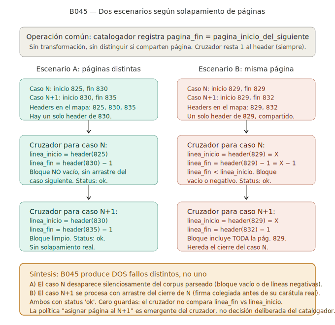
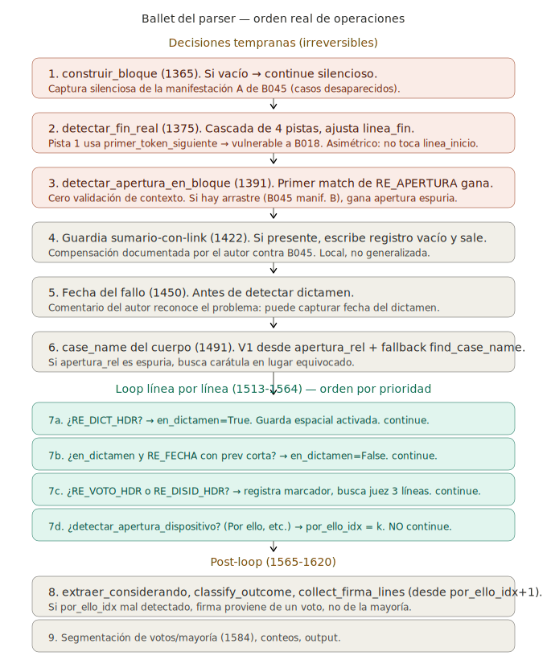

# Gramática del fallo y arquitectura deseada del parser

> **Estado del documento**: reflexión arquitectónica preliminar, producto
> principal de la sesión H025 (16/5/2026). Captura una propuesta
> alternativa de diseño para el parser, motivada por hallazgos sobre
> B045 y por la observación empírica de que `auditar_fallo.py`, con la
> misma información que el parser, segmenta mejor los bloques. El
> documento no propone implementación inmediata: registra el marco
> conceptual y las opciones consideradas, para que sirva de insumo a
> decisiones futuras en H026+.
>
> Nada de lo escrito acá modifica el pipeline vigente. La discusión es
> propositiva, no normativa.

---

## Por qué este documento

El pipeline actual procesa cada fallo como una unidad aislada. El
parser recibe un bloque del catálogo, lo recorre con un conjunto de
expresiones regulares, y produce los campos del CSV de producción.
Cada bloque se procesa con su propia lógica interna, sin consultar a
los vecinos. Cuando todo está bien acotado, el resultado es correcto.
Cuando hay imperfecciones en la acotación —tema central de B045—, los
problemas se manifiestan de varias formas: aperturas detectadas en
lugar equivocado, firmas que pertenecen al fallo anterior pero se
asignan al actual, casos que directamente desaparecen del corpus de
producción sin warning.

La sesión H025 examinó el código del catalogador, el cruzador y el
parser con el objetivo de entender cómo se distribuyen las decisiones
entre las cuatro etapas y dónde se originan exactamente las fallas. La
conclusión del análisis es que el modelo actual del parser no respeta
la estructura tipográfica del documento que está procesando, y que
varias compensaciones documentadas en el código mismo son evidencia de
que el autor del parser ya percibió estas limitaciones pero las parchó
localmente en vez de revisar la arquitectura.

La propuesta que se desarrolla a continuación —**parsing por gramática
con diálogo entre vecinos**— surge como reflexión arquitectónica
emergente de esa lectura, conversada en H025 entre Guillermo Rubinetti
y Claude. No es una solución cerrada. Es un cambio de marco que
merece ser examinado, discutido y eventualmente comparado contra
implementaciones más conservadoras.

---

## El fallo como documento estructurado

Antes de proponer una arquitectura para el parser, conviene fijar el
modelo del objeto que el parser procesa. Un fallo de la Corte Suprema,
tal como aparece impreso en *Fallos* y reflejado en el corpus `.md`,
tiene una estructura tipográfica reconocible. No es texto libre: es un
documento con secciones convencionales que aparecen en un orden
relativamente estable.

Un fallo típico comienza con su **carátula**: la línea que identifica
el caso por sus partes ("Y.P.F. S.A. c/ Mercante Hnos. s/ Recurso
extraordinario", o equivalentes). Inmediatamente después puede
aparecer un **sumario editorial**, en mayúsculas, breve, terminado en
punto, que sintetiza el punto doctrinario tratado. A veces hay más de
un sumario consecutivo: cuando el fallo aborda varios puntos
doctrinarios distintos, el editor publica un sumario por cada uno. La
sucesión de sumarios no tiene un tope fijo.

Después de los sumarios, o directamente después de la carátula si no
hay sumarios, puede aparecer el **dictamen del Procurador General**.
El dictamen tiene su propia firma —el nombre del procurador— y su
propia fecha. Está numerado internamente con romanos (I., II.,
III...). No todos los fallos tienen dictamen: las denegatorias del
artículo 280, por ejemplo, suelen resolverse sin dictamen previo.

Después del dictamen, o directamente después de los sumarios si no hay
dictamen, comienza el **fallo propiamente dicho**. Empieza con una
línea que identifica la ciudad y la fecha ("Buenos Aires, [día] de
[mes] de [año]") o con un marcador clásico ("FALLO DE LA CORTE
SUPREMA"). Sigue con los considerandos, numerados con arábigos entre
paréntesis o seguidos de paréntesis (1), 2), 3)..., a veces con el
formato 1°, 2°, 3°). Termina con la fórmula dispositiva, abierta por
una expresión como "Por ello," o "Por todo lo expuesto," seguida del
resolutorio. La sección de cuerpo del fallo cierra con la **firma
colegiada** de los ministros de la mayoría: una serie de nombres
separados por puntos, en líneas consecutivas.

Después de la firma de mayoría pueden aparecer **votos individuales**,
**concurrencias** y **disidencias**. Cada uno es un mini-fallo:
encabezado tipo "Voto del señor ministro doctor X" o "Disidencia del
señor ministro doctor Y", considerandos numerados, dispositiva con
"Por ello", firma individual del ministro. Aparecen en el orden que el
autor del fallo o el editor decide, sin convención fija sobre si las
disidencias van antes o después de los votos concurrentes.

Al final del fallo, en muchos casos, aparece una **sección editorial
de cierre**: incluye referencias procesales del editor ("Tribunal de
origen: Cámara X, Sala Y", "Recurso extraordinario interpuesto por:
..."), datos sobre el tipo de recurso, eventualmente la composición
del tribunal de origen. No es texto judicial: es aparato editorial
que la imprenta agrega para facilitar la búsqueda. El parser actual
no la modela explícitamente: la trata como ruido al final del bloque.

Existen casos minoritarios que se apartan de este patrón. Hay fallos
de tres o cuatro líneas que son apenas notas editoriales con un link
a otra publicación: la entrada en el corpus contiene la carátula y
una referencia a "Ver Fallos, t. 345, p. 1234", sin texto judicial.
Hay fallos sin firma colegiada visible. Hay fallos donde el dictamen
y el fallo de la Corte aparecen en orden inverso al esperado por
particularidades del año o del tomo. Estos casos no rompen el modelo
—son producciones alternativas del mismo lenguaje— pero exigen que
cualquier parser robusto los contemple explícitamente.

Lo importante es que esta estructura **no es invención del analista**:
es la convención tipográfica que el editor de *Fallos* aplica
deliberadamente para que cada fallo sea reconocible. El parser actual
ignora esta convención. La propuesta de este documento es respetarla.

### Cuando dos fallos comparten página

Antes de seguir con el análisis del parser, conviene fijar un caso
particular que motivó buena parte de la reflexión de H025: qué pasa
cuando dos fallos consecutivos comparten una página física del libro
impreso. Este escenario aparece con frecuencia: el caso N termina al
medio de la página, y el caso N+1 empieza en la misma página, justo
después. El catálogo, que lee el índice editorial, registra ambos
casos correctamente. Pero la frontera entre los dos casos no coincide
con la frontera de la página, y eso es lo que tensiona toda la
cadena de etapas posteriores.

El diagrama siguiente muestra los dos escenarios que produce esta
situación: cuando los casos están en páginas físicas distintas (todo
funciona bien), y cuando comparten una misma página (donde nace
B045 en sus dos manifestaciones).

La síntesis del diagrama es que B045 no es un bug, son dos. Cuando
dos casos comparten página única, el caso N recibe un bloque vacío y
desaparece silenciosamente del corpus de producción (manifestación
A). Y el caso N+1 recibe un bloque que incluye la página entera, lo
cual significa que hereda el cierre del caso N como arrastre
(manifestación B). El cruzador escribe ambas filas con status `ok`,
sin warning. Esta es la situación que la propuesta arquitectónica
busca resolver.

---

## Cómo lee el parser actual

El parser, al recibir un bloque, hace una serie de operaciones cuyo
orden no respeta la lectura tipográfica del documento. La primera
operación significativa es **detectar la apertura** —la línea que
contiene "FALLO DE LA CORTE SUPREMA"— y registrar su posición. Esta
posición se convierte inmediatamente en referencia para todas las
operaciones siguientes. La carátula se busca cerca de esa posición.
La fecha del fallo se busca cerca de esa posición. El tribunal de
origen se busca a partir de esa posición.

Esto es leer el documento desde la mitad hacia los costados. En
términos tipográficos, "FALLO DE LA CORTE SUPREMA" es el cuarto
elemento de la secuencia (carátula → sumarios → dictamen → fallo).
Anclar todo el procesamiento en ese cuarto elemento significa que si
ese elemento se detecta en posición equivocada —cosa que pasa cuando
hay arrastre de un caso anterior, manifestación B de B045—, el resto
del análisis hereda el error.

Después de las decisiones tempranas, el parser entra a un loop por
línea que sí tiene una pequeña máquina de estados implícita: detecta
dictamen primero, después votos y disidencias, después la fórmula
"Por ello". El estado `en_dictamen` actúa como guarda espacial: las
líneas marcadas como dictamen no se evalúan con las regex de voto ni
de dispositiva. Esto funciona razonablemente bien, pero llega tarde
en el procesamiento: la decisión crucial sobre la apertura ya está
tomada.

El parser también tiene tres compensaciones documentadas en
comentarios del código, cada una un parche defensivo contra un
problema arquitectónico que el autor reconoció pero decidió no
revisar a fondo. La primera es la guarda de "sumario con link": si
el bloque contiene el patrón de nota editorial con link, el parser
asume que cualquier firma detectada en ese bloque es arrastre del
fallo anterior y escribe un registro vacío. La segunda es la
extracción de fecha antes de la detección de dictamen: el comentario
del autor reconoce que la fecha del dictamen puede ser capturada
erróneamente como fecha del fallo, y declara explícitamente que
reordenar el código sería demasiado costoso. La tercera es el
fallback en tres niveles para encontrar fecha cuando la lógica nueva
falla. Tres compensaciones distintas para un mismo problema: el orden
de operaciones está mal pero parcharlo línea por línea es más barato
que repensarlo.

`detectar_fin_real`, la función que ajusta dónde termina el bloque,
tiene una arquitectura más sofisticada: implementa búsqueda en
cascada por cuatro pistas (carátula del siguiente caso, sumario del
siguiente caso, marcador de apertura del siguiente caso, firma del
caso actual). Cada pista activa una búsqueda restringida y devuelve
un status descriptivo del resultado. Esta función es una versión
preliminar del modelo que este documento propone: detección por
anclas tipográficas, validación por geometría del bloque, reporte
explícito de qué pista se usó. Pero `detectar_fin_real` ajusta sólo
el final del bloque, nunca el principio. Esa asimetría es parte del
problema: cuando el bloque tiene arrastre al inicio (manifestación B
de B045), no hay ninguna función equivalente que lo detecte.

El diagrama siguiente sintetiza el orden de operaciones del parser
sobre un bloque, distinguiendo las decisiones tempranas
(irreversibles, condicionan todo lo que sigue) del loop por línea
(donde sí opera una máquina de estados rudimentaria) y del
post-loop (donde se segmentan los votos y se construye la firma).

El diagrama hace visible algo que el código distribuye en cuatrocientas
líneas: la primera decisión que toma el parser cuando entra a un
bloque —si el bloque no está vacío, qué línea es la apertura— se toma
sin información de contexto y no se revisa nunca. Todo el procesamiento
posterior depende de esa decisión. Las compensaciones que el autor del
parser introdujo (sumario-con-link, fallback de fecha, fallback de
case_name) viven después de esa decisión y no pueden corregirla
retroactivamente. La propuesta arquitectónica del próximo apartado
ataca exactamente este punto.

---

## El fallo como gramática

La propuesta arquitectónica de este documento es modelar el fallo
como una **gramática**: un conjunto de reglas que dicen qué sección
puede seguir a qué otra. El parser deja de ser una bolsa de regex que
compiten por matchear el bloque y pasa a ser un reconocedor
estructural que camina el documento sabiendo en cada momento qué
secciones son legítimas a continuación.

En lenguaje natural, las reglas son las siguientes. Un caso comienza
con su carátula. Después de la carátula pueden aparecer uno o más
sumarios editoriales, o ninguno. Si hay dictamen del Procurador, viene
después de los sumarios. Después aparece el fallo propiamente dicho
con su firma colegiada. Al final pueden aparecer concurrencias,
disidencias y votos individuales en cualquier orden, cada uno con su
propia firma. Eventualmente cierra una sección editorial con
referencias procesales. El caso termina ahí, y lo que viene después
ya es el caso siguiente.

Lo importante de pensar así no es la estructura en sí —que es obvia
para cualquiera que haya leído fallos—, sino lo que ese modelo le
permite hacer al parser. Cuando el parser está en la sección "firma
colegiada", **sabe** qué puede venir a continuación: una concurrencia,
una disidencia, una sección editorial, o el fin del caso. Si lo que
aparece es ninguna de esas cosas —por ejemplo, una nueva carátula—,
eso es **violación de la gramática**. Y la violación no es ruido a
descartar: es información. Probablemente significa que el bloque está
mal acotado y el caso actual ya terminó.

Tres ejemplos concretos de cómo este modelo cambia el procesamiento:

**Bloque con arrastre del caso anterior.** El bloque empieza con
texto que no es carátula reconocible. El parser actual matchea la
primera apertura que encuentra y construye todo a partir de ahí. El
parser gramatical, en cambio, detecta inmediatamente que el primer
elemento no encaja en el inicio del lenguaje ("CASO empieza con
CARATULA"). Marca la anomalía y busca la primera carátula plausible
hacia adelante, asumiendo que lo que está antes es arrastre del caso
previo. El error se diagnostica y se corrige usando la gramática,
sin tocar el catálogo.

**Bloque con dos casos pegados.** Dentro del bloque, después de la
firma colegiada, aparece otra carátula. El parser actual no lo nota y
sigue procesando como si todo fuera un caso. El parser gramatical
sabe que la transición FIRMA → CARATULA no es legítima dentro del
mismo caso: la carátula nueva pertenece al caso siguiente. Corta el
caso actual ahí y registra que el bloque catalográfico contenía dos
casos.

**Múltiples sumarios consecutivos.** El parser actual no modela
sumarios consecutivos: detecta uno y sigue. El parser gramatical
permite la producción SUMARIO → SUMARIO: después de un sumario puede
venir otro sumario, sin límite teórico. Los detecta a todos y los
registra individualmente.

La gramática no es un lujo conceptual. Es la diferencia entre un
parser que silencia los problemas y un parser que los identifica.

### El epílogo: producción faltante

La descripción en lenguaje natural de más arriba menciona que
"eventualmente cierra una sección editorial con referencias
procesales". Esa sección editorial merece tratamiento explícito como
producción gramatical propia, porque tiene estructura interna estable
y porque sin reconocerla el parser pierde información o la asigna al
caso equivocado.

Llamamos **epílogo** al bloque que va entre la firma del cuerpo
principal del fallo y la carátula del caso siguiente. Empíricamente
identificado en la corrida `--random 80` de la sesión H026, el
epílogo tiene los siguientes componentes posibles, en este orden
cuando coexisten:

1. **Continuación de firma.** Apellidos de jueces o conjueces que el
   detector de firma cortó. Una o dos líneas, típicamente con punto
   final o separador em-dash.
2. **Bloque de recurso.** "Recurso [extraordinario / de hecho / de
   queja / ordinario / de reposición / de apelación / de revocatoria
   / directo] interpuesto por X, representado por el Dr. Y, con el
   patrocinio letrado del Dr. Z." Una variante usa "Recursos
   extraordinarios" o "deducido" en lugar de "interpuesto".
3. **Bloque de traslado.** "Traslado [del recurso extraordinario]
   contestado por W, representado por...". Aparece típicamente
   después del bloque de recurso. Puede aparecer un segundo bloque
   de recurso después del traslado.
4. **Bloque de partes alternativo.** "Parte actora: X.", "Parte
   demandada: Y.", "Tercero citado: Z.", "Parte ejecutante: ...",
   "Profesionales intervinientes: doctores...". Convive con el bloque
   de recurso en algunos casos.
5. **Bloque de nombres legacy.** "Nombre del actor: ...", "Nombre de
   los actores: ...", "Nombre de la demandada: ...". Convención
   editorial más antigua, todavía presente en tomos altos. Convive
   con la convención "Recurso ... interpuesto por" sin reemplazarla
   limpiamente.
6. **Tribunal de origen.** "Tribunal de origen: [nombre del
   tribunal]." Único marcador del tribunal de la instancia inmediata
   anterior. Casi siempre presente cuando hay epílogo.
7. **Tribunales intervinientes anteriores.** "Tribunal que intervino
   con anterioridad: ..." / "Tribunales que intervinieron con
   anterioridad: ..." / "Otros tribunales que intervinieron con
   anterioridad: ...". Lista de instancias inferiores intermedias.

Todos opcionales. El orden interno es estable cuando coexisten:
continuación de firma primero, recurso/traslado/partes después,
tribunal de origen, tribunales intervinientes al final. Los headers
de página atraviesan el epílogo transversalmente (el corte de página
no termina el epílogo).

**Por qué este span importa.**

El modelo actual del auditor (diez tipos de span) no tiene producción
para el epílogo. El contenido editorial post-firma cae en `catch_all`
cuando queda dentro del bloque correcto, o arrastra al catch_all
inicial del caso siguiente cuando `detectar_fin_real` corta antes.
La consecuencia es triple:

- El catch_all pierde poder diagnóstico: ya no es "lo que la
  heurística no logró clasificar" sino "lo que la heurística no
  logró clasificar más lo que sistemáticamente no busca clasificar".
- `detectar_borde_inferior` reporta falsos positivos de
  `EST_GAP_RESIDUO` para epílogos editoriales normales.
- La lógica de extracción de tribunal de origen del parser actual
  busca en todo el bloque, sin restricción de span. Un "Tribunal de
  origen" mencionado dentro de un sumario o dictamen puede contaminar
  la extracción. Con span propio, la búsqueda se restringe al lugar
  correcto.

**Marcadores explícitos del epílogo.**

Cada componente abre con una línea identificable por regex:

1. `^(Recurso|Recursos)\s+(extraordinario|de\s+hecho|de\s+queja|ordinario|de\s+reposición|de\s+apelación|de\s+revocatoria|directo|directos)\s+(interpuesto|deducido|interpuestos)`
2. `^Traslado\s+(contestado|recibido|del\s+recurso)`
3. `^(Parte|Partes)\s+(actora|demandada|ejecutante|querellante|recurrente|coactora|codemandada)`
4. `^Tercero\s+(citado|interviniente)`
5. `^Profesionales\s+intervinientes`
6. `^Nombre\s+(del|de\s+los|de\s+la|de\s+las)\s+(actor|demandado|demandada|actores|demandados|actoras|demandadas)`
7. `^Tribunal\s+de\s+origen\s*:`
8. `^(Tribunal|Tribunales|Otros\s+tribunales)\s+(que\s+intervino|que\s+intervinieron|intervinientes)`
9. Continuación de firma: `linea_es_continuacion_firma` ya
   implementado en `scripts/auditoria/auditar_fallo.py` líneas
   159-211.

Estos nueve marcadores cubren todos los componentes del epílogo
observados en los 48 catch_all finales de la corrida `--random 80`.
La verificación de persistencia editorial sobre el corpus completo
queda pendiente (M06 en `DEUDA_TECNICA.md`).

**El detector de epílogo resuelve implícitamente el borde superior.**

El borde superior es el problema simétrico del borde inferior:
detectar qué líneas, antes de la carátula declarada del caso N+1,
son en realidad residuo del caso N. La auditoría empírica muestra
que en aproximadamente el 78 % del corpus el inicio del bloque del
caso N+1 viene contaminado (catch_all inicial no vacío en 62 de 80
casos).

De ese 78 %, aproximadamente la cuarta parte (16 casos, 25,8 % del
catch_all inicial) es epílogo del caso N arrastrado. Si el detector
de epílogo se extiende "hacia adelante" desde la firma del caso N
hasta encontrar la carátula del N+1, lo que quede arrastrado al N+1
será solo el residuo verdadero (los otros bugs: corte a mitad de
oración, corte antes del Por ello, carátula no detectada). Es decir,
el detector de epílogo **es** el detector de borde superior para el
subset epílogo-puro. Los otros componentes del borde superior
requieren fixes independientes (B048 modos A y B en
`DEUDA_TECNICA.md`).

---

## El diálogo entre vecinos

La gramática sola resuelve muchos casos. Pero hay un escenario
específico que la gramática no resuelve por sí misma: cuando dos
fallos comparten una página física. En ese caso, el bloque que el
catálogo le entrega al parser puede arrastrar contenido del caso
anterior o ceder contenido al caso siguiente. Resolverlo desde dentro
de un solo bloque es imposible: no hay información suficiente.

La segunda capa de la propuesta es **que los bloques dialoguen entre
sí**. Cuando el parser procesa el caso N, tiene acceso a información
sobre el caso N+1: qué carátula esperar, qué primer ancla detectable
debería tener. Y simétricamente, al procesar el caso N+1, sabe qué
firma esperar del N si quedó arrastrada. La frontera entre dos casos
deja de ser una línea que cada uno asume aisladamente, y pasa a ser
una negociación entre vecinos.

Concretamente: si el caso N+1 detecta firma colegiada al principio de
su bloque, **antes** de encontrar carátula, esa firma probablemente
pertenece al caso N. La gramática local diría "violación: bloque
arranca con FIRMA". La vista relacional dice: "la firma pertenece al
vecino izquierdo, devolvérsela". Simétricamente, si el caso N termina
sin haber encontrado firma colegiada y el N+1 empieza con firma
huérfana, el sistema reconcilia los dos bloques: el N se extiende
hasta esa firma, el N+1 empieza después.

Esta arquitectura resuelve B045 sin tocar el catálogo, sin tocar el
cruzador, y sin gramática perfecta. Las páginas compartidas dejan de
ser datos sucios que el catálogo no pudo limpiar y pasan a ser un
fenómeno conocido que el parser sabe manejar mediante consenso entre
vecinos.

El precio que paga el diálogo es que introduce dependencias entre el
procesamiento de casos consecutivos. Mal manejado, un error en la
detección de un caso puede contaminar a sus vecinos, y los vecinos a
los suyos, generando una cascada de errores que arrastre todo el
corpus. Esto es real y no debe minimizarse. Pero la cascada se
controla con reglas conservadoras de negociación: sólo se mueve
contenido entre vecinos cuando ambos lados tienen detección de
gramática limpia. Si N tiene violaciones internas, no se le devuelven
cosas a N —se marca para revisión. La cascada se detiene en cualquier
nodo donde no haya consenso.

Una observación final sobre el diálogo: el parser actual ya tiene una
versión rudimentaria de él, en la función `detectar_fin_real`. Su
pista 1 usa `primer_token_siguiente`, que es información sobre la
carátula del caso N+1, para decidir dónde termina el caso N. Es decir
que la idea de consultar al vecino ya está implementada parcialmente,
pero como heurística defensiva limitada a un caso particular. La
propuesta generaliza esa idea y la hace explícita en toda la
arquitectura.

---

## Tres formas posibles de implementar

Una vez aceptada la propuesta de gramática más diálogo, queda la
pregunta de cómo se implementa. Hay tres formas posibles, con
trade-offs distintos.

### Forma 1: dos pasadas separadas

El parser corre dos veces sobre el corpus. En la primera pasada, cada
bloque se procesa aisladamente con la gramática local: se intenta
reconocer la secuencia de secciones, se detectan violaciones, se
emiten spans tipados y una lista de anomalías. En la segunda pasada,
se recorren pares de casos vecinos y se aplican reglas de
negociación: la firma huérfana al inicio del N+1 se mueve al final
del N si N terminó sin firma; el arrastre de cierre se descuenta;
etcétera. Las reglas son explícitas y conservadoras.

**Ventajas.** Es la implementación más testeable: cada pasada hace una
cosa, y si la segunda pasada introduce un bug, sabés que el bug está
en las reglas de negociación. Mantiene el auditor como oráculo
durante todo el proceso, porque el auditor procesa bloque por bloque
y es comparable a la pasada 1. Permite implementación incremental:
primero la pasada 1 sola, validada contra el corpus, recién después
la pasada 2.

**Desventajas.** Requiere mantener dos modelos del corpus en la
cabeza (después de pasada 1, después de pasada 2). Si las reglas de
negociación son conservadoras, muchos casos B045 quedan sin
resolver: el parser produce mejor diagnóstico pero no
necesariamente mejor segmentación. La decisión de qué reglas son
"conservadoras" requiere juicio empírico.

### Forma 2: una pasada con vista relacional

El parser procesa los casos uno por uno, pero al procesar el caso N
tiene acceso a información de N-1 y N+1. La detección de carátula
busca primero dentro del bloque; si encuentra ambigüedad, consulta el
bloque N+1 para ver si la "segunda carátula" del bloque N en realidad
es la primera carátula del N+1. La búsqueda de firma puede extender
hasta el inicio del bloque N+1 si dentro del bloque N no aparece
firma colegiada. Es un parser con mirada periférica.

**Ventajas.** Lógica más unificada: no hay dos pasadas con dos
modelos mentales separados, hay un solo parser que sabe mirar a los
costados. Probablemente produce mejor segmentación en una sola
corrida sobre casos B045 difíciles, porque las decisiones se toman
con toda la información disponible. Más cerca conceptualmente de
cómo un lector humano lee el corpus.

**Desventajas.** Mucho más difícil de testear. Cada decisión depende
de información de los vecinos, lo cual significa que reproducir un
bug requiere reproducir el estado de tres bloques simultáneos. La
separación de responsabilidades se pierde: no se puede decir "este
es un bug de detección de carátula" porque la detección de carátula
depende de la detección de carátula del vecino. Para un proyecto
manejado por una sola persona, esta arquitectura es frágil.

### Forma 3: convergencia iterativa

El parser procesa el corpus completo en una pasada inicial. Después,
en una segunda pasada, identifica todos los pares con inconsistencias
y ajusta fronteras según reglas. Vuelve a parsear con las fronteras
ajustadas. Identifica nuevas inconsistencias, ajusta de nuevo. Itera
hasta convergencia o hasta un número máximo de iteraciones.

**Ventajas.** En teoría, la más robusta ante propagación de errores.
Cada iteración refina el estado. Modela bien la naturaleza
retroalimentada del problema.

**Desventajas.** Difícil garantizar convergencia: una regla mal
escrita puede producir oscilaciones (A le da firma a B, B le devuelve
carátula a A, A vuelve a darle firma a B). Difícil debuggear: si
después de cinco iteraciones el caso X quedó mal, ¿en qué iteración
se rompió? Necesita logging exhaustivo. Y la noción de "ya no hay
inconsistencias" requiere un criterio formal que tampoco es trivial.
Para un corpus de 5.800 casos, la sofisticación es desproporcionada.

### Recomendación preliminar

**Empezar por Forma 1, sólo pasada 1.** Implementar la gramática del
fallo aisladamente sobre cada bloque, sin diálogo entre vecinos.
Validar sobre el corpus actual: contar cuántos casos pasan la
gramática limpia, cuántos tienen violaciones, comparar contra el
auditor. Esto solo ya debería resolver una fracción importante de
los bugs documentados en DEUDA_TECNICA, sobre todo los que son
detección equivocada de apertura por arrastre.

**Con la pasada 1 funcionando, evaluar.** Mirar cuántos casos B045
quedan sin resolver. Si son pocos (menos del 1%), el costo-beneficio
de agregar pasada 2 es alto. Si quedan muchos (5-10%), vale la pena
la pasada 2.

**No usar Forma 3** salvo que la Forma 1 más Forma 2 demuestren no
alcanzar, y haya evidencia clara de que el problema necesita
iteración.

La razón general es que lo más robusto no es la forma más
sofisticada, sino la forma más simple que resuelve el problema. Si
la pasada 1 sola resuelve el 90% de los casos problemáticos, agregar
más complejidad por el 10% restante es mala ingeniería. Hay otra
opción para ese 10%: documentarlo como "casos editoriales
irreducibles" y procesarlos manualmente con el auditor como
herramienta.

---

## Qué de esto ya está en `auditar_fallo.py`

Una pregunta abierta de H025, que se aplaza a H026, es cuánto de esta
propuesta ya está implementado en el auditor. La lectura preliminar
del docstring y de los nombres de funciones sugiere que el auditor
implementa una versión parcial de la gramática: produce spans tipados
con cobertura total del bloque, valida orden de spans, emite un
catch-all explícito para lo que no clasifica. Esto es estructuralmente
más cercano a la propuesta que el parser de producción.

Si la lectura detallada del auditor confirma esta impresión, el camino
a implementación de la Forma 1 pasada 1 puede ser más corto de lo
estimado: no sería refactor desde cero del parser, sino promoción del
auditor a parser de producción con el agregado de la gramática
explícita y las validaciones de transición entre secciones. Es una
hipótesis a verificar en H026.

### Refinamiento post-lectura del auditor (H026)

La lectura del código del auditor en H026 (hasta línea 414,
`detectar_borde_inferior` inclusive) y la corrida empírica
`--random 80` permiten precisar qué de la gramática ya está y qué
falta concretamente.

**Lo que está implementado:**

- Modelo de spans tipados disjuntos con cobertura total. Diez tipos
  (carátula, sumario, dictamen, cuerpo_mayoria, voto, disidencia,
  firma, sumario_con_link, header_pagina, catch_all). Invariante
  declarado y verificado: toda línea del bloque pertenece a al menos
  un span.
- Reuso por importación de los regex y helpers de `parser.py`. La
  diferencia entre auditor y parser no está en qué reciben sino en
  cómo procesan.
- API canónica `auditar_fallo(tomo, pagina) -> dict` pensada para uso
  programático, no solo para output Markdown.
- Diálogo entre vecinos en la dirección N → N+1: la función
  `_clasificar_linea_gap` usa `primer_token_siguiente` (dato del
  caso siguiente) para clasificar líneas del gap del caso actual.
  El orden de prioridad de las clasificaciones está pensado para que
  la información del vecino tenga precedencia.
- Detector `linea_es_continuacion_firma` con set hardcodeado de 17
  apellidos titulares y tres pistas discursivas (mayúsculas, longitud
  + puntuación, em-dash).
- Detector `detectar_borde_inferior` con 6 estados y 4 alertas
  independientes. Diagnostica composición del gap entre
  `linea_fin_real` y `linea_inicio` del próximo caso.

**Lo que falta:**

- **Producción `epilogo`** (ver sección "El epílogo: producción
  faltante"). Diez tipos pasarían a once + sub-componentes
  opcionales.
- **Detector de borde superior** simétrico al inferior. En su forma
  más simple, lo provee el detector de epílogo al extender el span
  del caso N hasta la carátula del N+1. En su forma robusta, sería
  un detector independiente que mira las líneas previas a
  `linea_inicio` del caso actual y emite indicios sobre arrastre del
  anterior.
- **Modelo por evidencia, no por reglas duras.** Las pistas que
  viajan entre vecinos (`primer_token_siguiente`,
  `linea_es_continuacion_firma`, marcadores del epílogo) hoy disparan
  clasificación dura por orden de prioridad. Un modelo más robusto
  trata cada detección como indicio con peso y resuelve por
  acumulación o desvirtuación. Esto cambia el modelo de decisión,
  no solo agrega detectores nuevos.
- **Validación de orden** (transiciones legítimas entre producciones).
  El auditor hoy clasifica spans pero no valida que la secuencia
  respeta la gramática. La transición FIRMA → CARATULA dentro del
  mismo bloque, por ejemplo, no se reporta como violación: se
  clasifica como dos spans contiguos sin alerta.
- **Validación de cardinalidad.** Múltiples sumarios consecutivos, o
  un solo voto sin disidencia, o disidencias sin votos
  correspondientes, no se reportan como anomalías.
- **Extracción de campos desde los spans.** El parser actual extrae
  tribunal de origen, fecha, status, etc. buscando en todo el bloque.
  En el modelo de spans, esa búsqueda se restringe al span
  correspondiente (tribunal de origen al span `epilogo`, fecha al
  span `cuerpo_mayoria` o al inicio del fallo). Esto requiere
  trasladar la lógica de `parser.py` (líneas 365-444 para tribunal
  de origen, líneas 1450-1475 para fecha) a operar sobre spans.

**Evidencia empírica de los límites del modelo actual.**

La corrida `--random 80` cuantifica varios límites:

- 91,2 % de los casos están en `EST_SOLAPADO`: el parser
  sistemáticamente extiende el bloque del caso N más allá del inicio
  del N+1. El borde inferior está sobre-disparado.
- 77,5 % de los casos tienen catch_all al inicio del bloque del N+1
  (residuo arrastrado del N). De ese residuo, el 25,8 % es epílogo
  puro (resoluble con la producción `epilogo`), el 56,4 % son modos
  de falla de `detectar_fin_real` (B048 modos A y B en
  `DEUDA_TECNICA.md`), y el 12,9 % son carátulas no detectadas del
  N+1 (B049).
- 55,7 % de los casos tienen catch_all al final del bloque (epílogo
  propio del caso). 48 % de esos catch_all finales son epílogo
  reconocible con los marcadores listados en la sección "El epílogo:
  producción faltante".

**Implicación para las tres formas de implementación** (sección
anterior "Tres formas posibles de implementar"). La promoción del
auditor a parser (cualquiera de las tres formas) no resuelve por sí
sola los modos de falla de `detectar_fin_real`. Esa función está
importada de `parser.py` y se ejecuta igual en el auditor. La
promoción del auditor a parser convierte al auditor en pasada 1 de
Forma 1, pero exige una pasada 0 o un fix in-place de
`detectar_fin_real` para resolver los modos A y B de B048.

### Refinamiento post-Fase A continuación (H027)

La lectura completa del auditor en H027 (detectores 4-12 del listado
H026 + orquestador `segmentar_bloque` + closers `_agregar_catch_all`,
`_ordenar_y_validar`, `_resolver_caso`) confirma y precisa dos cosas
declaradas previamente y agrega tres mecanismos nuevos.

**Confirmación: el borde superior y el epílogo son el mismo problema
estructural, en dos direcciones.**

H026 ya había identificado que el modelo de spans del auditor "carece
de producción `epilogo`" y que "el borde superior es estructural, no
marginal". La lectura H027 muestra que ambas afirmaciones describen
caras de un mismo problema: **el catch_all es un colector pasivo, no
un clasificador**, y por construcción absorbe cualquier residuo que
los detectores no clasifican, sin distinguir entre (a) material del
fallo previo arrastrado al inicio del bloque actual y (b) material
del fallo actual no clasificado al final. Las dos formas de residuo
operan en direcciones opuestas pero comparten causa:

- **Borde inferior (epílogo no detectado al final del fallo N):** el
  material editorial post-firma — tribunal de origen, recurso de
  queja interpuesto por, partes, representación letrada — no tiene
  detector propio. Cae en catch_all final, o queda absorbido por el
  span del último voto/disidencia (B051), o por extensión espuria del
  span de firma de la mayoría (B050).
- **Borde superior (catch_all inicial como prosa del previo):** las
  primeras líneas del bloque del fallo N+1 pueden contener residuo
  del N (B045 mB). El detector de carátula (B049) no usa el último
  header de página antes del dictamen/apertura como ancla del rango
  de búsqueda, por lo que puede devolver una línea de prosa de
  epílogo del previo como carátula del N+1.

Los dos bordes son la misma producción `epilogo` (faltante) vista
desde dos lados: desde el caso N (cierre que no se detecta) y desde
el caso N+1 (apertura cuya ancla superior está corrida por el
residuo). Implementar la producción `epilogo` resolvería ambos:

1. El span `epilogo` del N termina en su última línea estructuralmente
   válida (último marcador del epílogo).
2. El detector de carátula del N+1 puede anclar su `inicio_busqueda`
   en la línea siguiente al último header de página después del fin
   del epílogo del N.

**Mecanismos nuevos identificados:**

- **`detectar_firma_mayoria` puede contaminar el span de firma con
  líneas del epílogo (B050).** El loop de extensión acepta líneas
  cortas que contengan un apellido de `JUECES_CONOCIDOS`. Ese set
  incluye 14 conjueces con apellidos comunes (Otero, Catania,
  Cavallo, Petrone, Hornos, Riggi, Mahiques, Figueroa, entre otros)
  que aparecen frecuentemente en el epílogo (representación letrada,
  tribunal de origen, integrantes de tribunales previos). La firma
  se extiende sobre la cola del fallo.
- **El último voto/disidencia absorbe el epílogo cuando hay votos
  disidentes (B051).** `detectar_votos_y_disidencias` cierra el
  último span en `len(bloque) - 1`. El epílogo queda dentro del span
  del último voto, no en catch_all. Esto explica parcialmente por
  qué el catch_all final aparece solo en el 55,7 % de los casos de
  `--random 80`: en casos con votos disidentes, está escondido.
- **`_ordenar_y_validar` no valida (M08).** La función ordena y
  devuelve. Las invariantes declaradas en `segmentar_bloque`
  (disjunción, cobertura) no se verifican en runtime. Una violación
  pasaría silenciosamente. Implicación para el modelo: la cobertura
  total que el auditor declara como invariante es un postulado, no
  un check.

**Refutaciones por lectura de código:**

- La hipótesis preliminar de B049 ("formato de carátula `X y otros
  c/ Y` o `APELLIDO, Nombre c/ Y` no contemplado") quedó refutada:
  ninguna de las tres estrategias del detector (formato B con `:`,
  formato A con par X-Y, fallback final) impone filtro de formato
  sobre la línea devuelta. La causa real es la falta de ancla
  superior, no el formato.
- La hipótesis HN3 del prompt H027 ("`APELLIDOS_FIRMA_TITULARES`
  incompleto para conjueces") quedó parcialmente refutada al
  encontrar que existen **dos sets paralelos**:
  `APELLIDOS_FIRMA_TITULARES` (9 apellidos, todos titulares, usado
  solo en `detectar_borde_inferior`) y `JUECES_CONOCIDOS` (29
  patrones, 14 conjueces, usado en `detectar_firma_mayoria`). El
  detector de firma principal SÍ cubre conjueces. El sesgo, si
  existe, opera en el borde inferior — específicamente en la
  clasificación `firma_arrastrada` de `_clasificar_linea_gap`, que
  perdería diagnóstico fino para casos con conjueces. Magnitud
  pendiente de cuantificar.

**Implicación operativa concreta: ancla candidata para `detectar_caratula`.**

El detector `detectar_headers_pagina` (paso 0 del orquestador) ya
identifica las líneas de header. Esa información no se está usando
como ancla del rango de búsqueda en `detectar_caratula`. Mejora
barata candidata: anclar el `inicio_busqueda` del detector de
carátula al último header de página antes del dictamen/apertura, no
en `0`. Esto no resuelve el problema estructural (el epílogo sigue
sin tener producción propia) pero corta el subset de B049 cuya
carátula real está pegada o muy cerca del último header de página.
Verificación necesaria sobre los 8 testigos antes de implementar.

**Lo que no cambia respecto de H026:**

- La sección "El epílogo: producción faltante" sigue siendo la
  referencia conceptual.
- Las tres formas de implementar siguen abiertas con la misma
  recomendación preliminar.
- La estimación de qué porcentaje del auditor se reutiliza en un
  parser de Forma 1 sigue pendiente (Fase F).

---

## Estado de la propuesta

Esta propuesta es **conceptual y provisional**. No hay decisión de
implementación. No hay roadmap. No hay compromiso de plazos. El
documento existe para que el pensamiento de H025 quede capturado en
un lugar estable, accesible para revisión futura.

Las decisiones que sí se toman en H025, y que figuran en los archivos
operativos del proyecto (BITACORA, DEUDA_TECNICA, PIPELINE), son las
siguientes:

- Refinar la entrada de B045 con los hallazgos de H025 sobre las dos
  manifestaciones del bug.
- Abrir B046 para la manifestación A (casos desaparecidos por bloque
  vacío en el cruzador).
- Anotar el acoplamiento entre B018 y `detectar_fin_real` pista 1.
- Actualizar el alcance de M01 (re-recorrer parser y actualizar
  PIPELINE).
- Agregar cuatro fricciones nuevas a PIPELINE.md en secciones ya
  existentes.

La propuesta arquitectónica desarrollada en este documento queda como
insumo para decisiones futuras. Sesiones posteriores pueden:

- Confirmar o refutar la propuesta a la luz de un análisis más
  profundo del auditor (H026).
- Realizar mediciones empíricas sobre el corpus que afinen las
  estimaciones (cuántos casos comparten página, cuántos sumarios
  consecutivos hay típicamente, qué porcentaje de fallos no tiene
  dictamen).
- Diseñar una implementación concreta de la Forma 1 pasada 1, si se
  decide proceder.
- Cualquier otra cosa que el trabajo posterior identifique.

Mientras tanto, el pipeline vigente sigue operando con su arquitectura
actual. Esta es una reflexión sobre cómo podría leerse mejor el
documento jurídico que el pipeline procesa; no es una crítica al
trabajo hecho.

---

*Documento producido en H025 (16/5/2026). Reflexión arquitectónica
conversada con Claude. Estado: borrador conceptual, sin compromiso
de implementación.*
